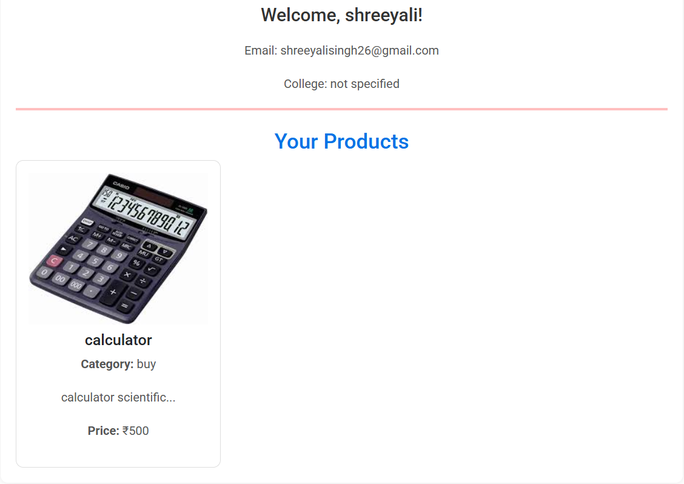
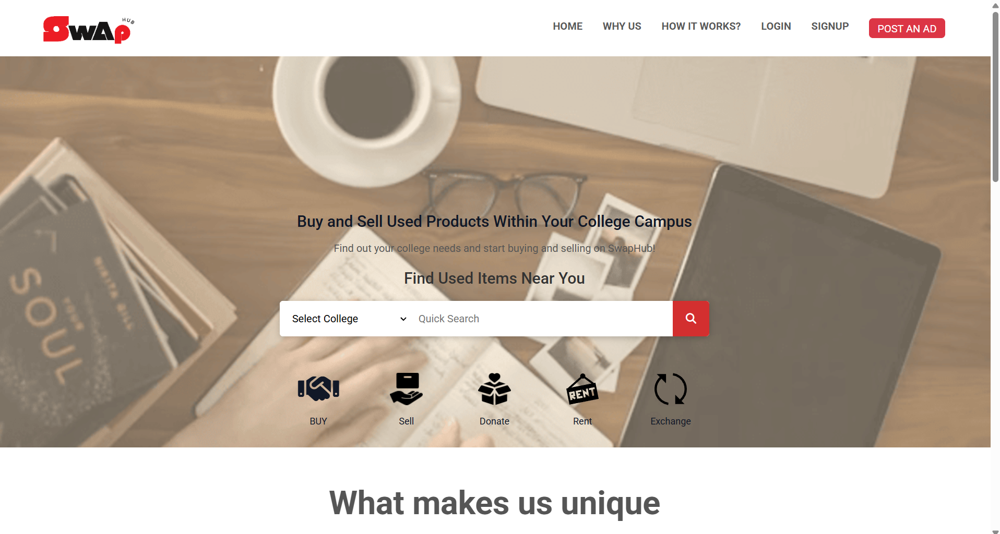

# SWAPHUB – Student Marketplace Platform

A MERN Stack-based web application tailored for college campuses, **SWAPHUB** serves as a digital marketplace for students to **buy, sell, and donate** goods with ease. It enhances student engagement through a clean UI/UX, real-time features, and secure authentication.

---

## 🚀 Features

- 🔐 **Secure Authentication**
  - JWT-based user login/signup
  - Role-based access control

- 📦 **Product Listings**
  - Add, edit, delete product entries
  - Upload multiple images via Cloudinary
  - Categories for easy filtering (books, electronics, etc.)

- 💬 **Chat System**
  - Real-time messaging using **Socket.io**
  - Instant notifications on interest or purchase

- 🖼️ **Media Management**
  - Cloudinary integration for image upload and optimization

- 🧑‍🎓 **User Dashboard**
  - Personalized view of listings, purchases, and donations
  - Activity insights and saved items

- 🌐 **RESTful APIs**
  - Clean and scalable API design for all operations

---

## 🛠️ Tech Stack

| Technology | Description                          |
|------------|--------------------------------------|
| MongoDB    | NoSQL database for scalable storage  |
| Express.js | Backend framework for Node.js        |
| React.js   | Frontend library for dynamic UI      |
| Node.js    | Runtime for server-side logic        |
| Socket.io  | Real-time bi-directional communication |
| Cloudinary | Image storage and CDN optimization   |
| JWT        | Secure authentication tokens         |

---

## 📈 Impact

- 🎯 Increased student engagement by **40%**
- 👥 Onboarded **4000+ college users**
- 🔄 Enabled **real-time** chat and updates
- ♻️ Promoted sustainability through **donation feature**

## Screenshot

